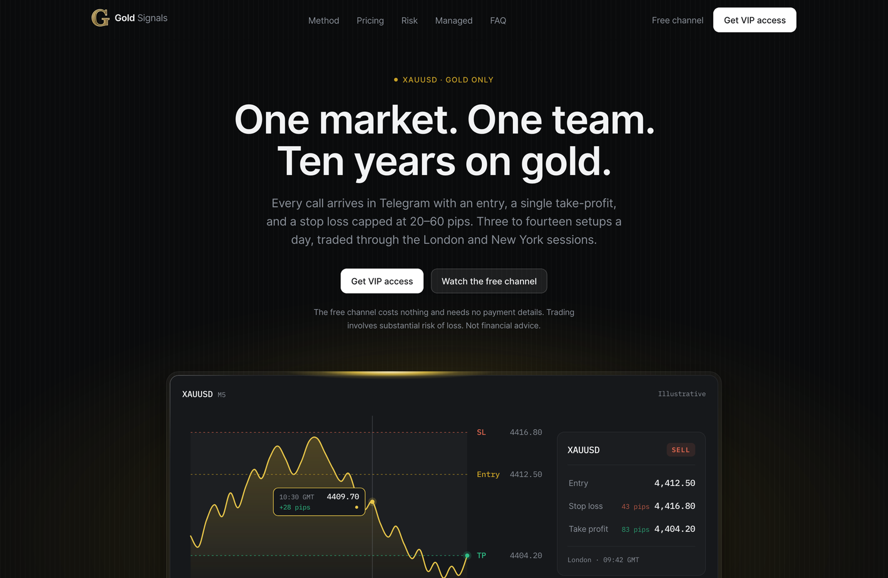

# Gold Signals

Single-page marketing site for a XAUUSD (spot gold) trading-signal service delivered through Telegram. Built as a static site with zero runtime dependencies beyond the framework itself.



---

## Tech stack

|               |                                                                                         |
| ------------- | --------------------------------------------------------------------------------------- |
| **Framework** | [Next.js 16.3](https://nextjs.org) — App Router, Turbopack (default in 16)              |
| **Runtime**   | React 19.2 — Server Components by default                                               |
| **Styling**   | [Tailwind CSS v4.3](https://tailwindcss.com) — CSS-first config, no `tailwind.config.*` |
| **Language**  | TypeScript 5.9, `strict`                                                                |
| **Fonts**     | Inter + IBM Plex Mono via `next/font/google`                                            |
| **Linting**   | ESLint 9 flat config (`eslint-config-next`)                                             |
| **Hosting**   | Any static host. No API routes, no environment variables, no database.                  |

**No animation, charting, or smooth-scroll libraries.** The chart, the scroll reveals, the count-ups and the smooth anchor scrolling are all hand-rolled in ~150 lines total. Total added JavaScript over the framework baseline: **0 kB**.

## What's on the page

Fourteen sections, ordered by the objection sequence a cold visitor actually has — _what is this → what do I get → is the method sane → what does it cost → will it blow up my account → can you do it for me → what about X → ok, join_.

Notable pieces:

- **The hero composition** — an animated SVG XAUUSD chart and a Telegram signal card describing the same trade. The card is real DOM, not a screenshot, so it stays crisp at any density and is readable by a screen reader. Scrub the chart to read price, timestamp and running P&L; hover a level to light it and its matching row on the card.
- **An interactive lot-size calculator** built from the service's published risk table, so the most static asset in the source material becomes the most useful thing on the page.
- **A real macro chart** of XAU/USD month-end closes, including the 2026 drawdown. It is not smoothed — a trading audience spots a flattered gold chart immediately, and the volatility is the argument the section is making.

## Getting started

```bash
npm install
npm run dev        # http://localhost:3000
```

| Script          |                                                                         |
| --------------- | ----------------------------------------------------------------------- |
| `npm run dev`   | Dev server (Turbopack)                                                  |
| `npm run build` | Production build                                                        |
| `npm start`     | Serve the production build                                              |
| `npm run lint`  | ESLint — note this is bare `eslint`; `next lint` was removed in Next 16 |

TypeScript is checked separately with `npx tsc --noEmit`.

## Project structure

```
src/
  app/
    layout.tsx              Fonts, metadata, Organization JSON-LD
    page.tsx                Composes the sections; Service + FAQPage JSON-LD
    globals.css             Design tokens, base layer, keyframes
    opengraph-image.jpg     1200×630 social card
    icon.png                Favicon
    llms.txt/route.ts       Generated /llms.txt
    robots.ts  sitemap.ts   Generated /robots.txt and /sitemap.xml
  components/
    ui/                     Reveal, SectionHead — shared primitives
    layout/                 Header, footer, logo
    hero/                   Hero, panel, chart, signal card, spec strip
    signal/                 Signal anatomy, broker note
    why-gold/               Why-gold cards, macro sparkline
    method/                 Method bento, how-it-works
    pricing/  risk/  managed/  faq/  cta/
  hooks/
    use-in-view.ts          IntersectionObserver, fires once
    use-count-up.ts         rAF easing, reduced-motion aware
    use-chart-scrub.ts      Shared pointer/keyboard scrubbing
    use-reduced-motion.ts   matchMedia via useSyncExternalStore
  lib/
    content/                All copy and data, split by section
    gold-series.ts          XAU/USD price data
    build-path.ts           Values → smoothed SVG path
```

### Editing content

Every string and number on the page lives in `src/lib/content/`, split by section with a barrel export. Import from `@/lib/content`, never from the leaf modules, so the internal layout can change without touching components.

```ts
import { PLANS, FAQ, LINKS } from "@/lib/content";
```

FAQ answers may contain a `{{XM}}` token, which renders as a link to the broker. Run answers through `plainText()` before putting them anywhere that takes plain prose (structured data already does this).

## Design system

Light canvas, one dark slab at the top, near-monochrome, hairline borders instead of shadows. Type and motion values were measured from computed styles on Attio and Linear rather than guessed — headings use a `-0.022em` tracking inflection, buttons use an asymmetric 300ms-out / 50ms-in transition.

Two colour rules that are load-bearing and documented at the top of `globals.css`:

1. **The accent follows the surface.** Olive green is the accent on light (5.80:1 on canvas); gold is the accent on dark (8.14:1 on the hero). Olive measures 3.31:1 on the dark slab and fails AA, so it must never appear there. Gold measures 2.36:1 on the canvas — failing even the 3:1 floor for graphical objects — so it must never appear on light. The one exception is the raster brand mark, which WCAG 1.4.11 exempts as a logotype.
2. **Every pairing was contrast-checked before being committed**, not eyeballed. The ratios are in the comments next to each token.

## Accessibility

- Reduced motion is respected throughout. The hidden state of every scroll reveal sits behind `prefers-reduced-motion: no-preference`, so a reduced-motion user sees content on first paint and never depends on JS to reveal it. Animation _delays_ are zeroed too, not just durations.
- The reveals are additionally gated on `@media (scripting: enabled)`, so the page renders fully even if JavaScript fails.
- The FAQ uses native `<details>`/`<summary>`; the chart and signal card are keyboard-operable; the mobile menu traps focus and closes on `Escape`.
- Visible focus rings everywhere, on the accent colour so they stay visible against the black primary buttons.

## SEO

- `metadataBase`, canonical, Open Graph and Twitter cards
- `Organization`, `Service` + `OfferCatalog`, and `FAQPage` structured data — no `aggregateRating`, because there are no real reviews
- `/robots.txt` and `/sitemap.xml`, generated from `SITE_URL`
- `/llms.txt` following [llmstxt.org](https://llmstxt.org), generated from the same content modules the page renders, including a "What this business does not claim" section so AI summaries repeat the honest framing

---

## Domain and deployment

The site is served from **`https://xauusdsignals.net`**, set once as `SITE_URL` in `src/lib/content/site.ts`. That single constant feeds `metadataBase`, the canonical tag, OG/Twitter URLs, `robots.txt`, `sitemap.xml` and `llms.txt`, so the domain is never hardcoded anywhere else — if it ever changes, change it there and nowhere else.

At the host, point the apex `A`/`ALIAS` record at the deployment and make `www` a **301 redirect to the apex** rather than a second live origin. The canonical tag names the apex; if `www` also serves the page, the two split the ranking signal and disagree with the canonical.

After deploying: submit `https://xauusdsignals.net/sitemap.xml` to Google Search Console, or indexing will take weeks.

## Content and claims policy

This site deliberately publishes **no win rate, no equity curve, and no testimonials**, because none of those could be substantiated from the source material. It competes on specificity instead — one take-profit, no partial closes, a stop capped at 20–60 pips, a published lot-size ladder. The 2,000-pip figure appears only as a clearly labelled monthly _target_, never as a result.

If you add performance claims later, they need substantiation. Unsubstantiated performance claims for a financial service are the exact language that regulators and payment processors flag, and the FTC's 2023 Endorsement Guides removed the "results not typical" safe harbour that used to cover them.

The broker recommendation is an affiliate placement. Every instance carries a visible disclosure adjacent to the link and `rel="sponsored"`, which is what the FTC Endorsement Guides and the UK CAP Code require — a disclosure in the footer alone would not be sufficient.
